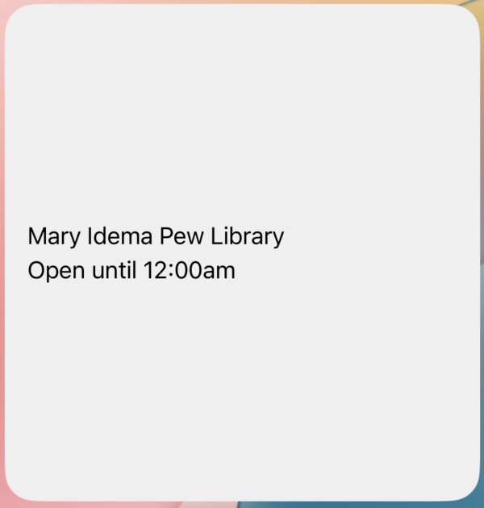

# WidgetKit Code Tutorial

## Overview

For this iOS programming tutorial, we will be creating an app to tell us the hours of GVSU's libraries. Using WidgetKit, we will be able to create widgets that show up to date information at a glance. Since we don't have room to show all four libraries, we'll have to allow the user to select an individual library to focus on and must decide what information to show/omit at different sizes.

## Getting Started

All we need to get started on this app is Xcode. On macos, you can install Xcode through the App Store. 


Once it's installed, you will be prompted to install the iOS simulator and other parts of the development toolchain. Once you have those installed, we can move on to starting our app.

## Steps

### Creating Our Project

Once you start Xcode for the first time, you will be prompted to create a new project from a template. Select App from the iOS tab and click "Next".


On the next page, you will be prompted for some more information about this app. The product name and organization identifier are up to you, but make sure to choose Swift for the language and SwiftUI for the interface. Then click "Next"


Finally, you have to choose where this project will go. Once you've chosen the destination, click "Create". Congrats! You now have a working app in Xcode.


### Adding a Widget

From Xcode, go to File > New > Target


On the next screen, select "Widget Extension" and click "Next".


You'll be prompted to give this extension a name. Once you're done, click "Finish".


Make sure to activate the scheme for our new target when prompted.


### Widget Configuration

Since we want users to be able to select a specific library to show, we need to add that option. We start by defining an enum that stores each possible option. 

```swift
//  AppIntent.swift
import WidgetKit
import AppIntents

enum LibraryEnum : String {
    case maryIdemaPew = "Mary Idema Pew Library"
    case steelcase = "Steelcase Library"
    case freyFoundation = "Frey Foundation Learning Commons"
    case lemmen = "Lemmen Library & Archives"
}
```

Then we need to tell Swift how to display each enum case using an extension.

```swift
//  AppIntent.swift
extension LibraryEnum: AppEnum {
    static var caseDisplayRepresentations: [LibraryEnum: DisplayRepresentation] = [
        .maryIdemaPew: DisplayRepresentation(title: "Mary Idema Pew Library"),
            .steelcase: DisplayRepresentation(title: "Steelcase Library"),
        .freyFoundation: DisplayRepresentation(title: "Frey Foundation Learning Commons"),
        .lemmen: DisplayRepresentation(title: "Lemmen Library & Archives"),
    ]
    
    static var typeDisplayRepresentation: TypeDisplayRepresentation {
        TypeDisplayRepresentation(
            name: LocalizedStringResource("Library", table: "AppIntents"),
            numericFormat: LocalizedStringResource("\(placeholder: .int) libraries", table: "AppIntents")
        )
    }
}
```

Finally, we describe the widget configuration (what shows up when you tap "Edit Widget" on iOS) and add our enum as one of the parameters.

```swift
//  AppIntent.swift
struct ConfigurationAppIntent: WidgetConfigurationIntent {
    static var title: LocalizedStringResource { "Configuration" }
    static var description: IntentDescription { "WidgetKit demo" }
    
    @Parameter(title: "Library", default: .maryIdemaPew)
    var library: LibraryEnum
}
```

### Building the ViewModel

To store the information we have on each library, we need to create a ViewModel that we can watch for updates. To get started, all we need to do is create a dictionary mapping the enum we just created to a physical building.

```swift
//  LibraryViewModel.swift
import SwiftUI

class LibrariesViewModel: ObservableObject {
    @Published var libraries: [LibraryEnum: Location] = [:]
}
```

Now that we have the ViewModel, we need to write the `Location` struct. Once we start talking to the api, this will let us parse the response and get the data we need.

```swift
//  LibraryViewModel.swift
struct Location: Codable, Identifiable {
    let id = UUID()
    let name: String
    let category: String
    let times: Times
    let rendered: String
    enum CodingKeys: String, CodingKey {
        case name
        case category
        case times
        case rendered
    }
}

struct Hours: Codable {
    let from: String
    let to: String
}

struct Times: Codable {
    let currently_open: Bool
    let hours: [Hours]?
}

struct LibrariesResponse: Codable {
    let locations: [Location]
}
```

### Talking to the API

Now that we're ready to parse the API response, it's time to start talking to it. To do this, we create a URL from a string, call `JSONDecoder().decode()` with the `LibrariesResponse` struct we created earlier, and put the locations we want in the ViewModel.

```swift
//  LibrariesHelper.swift
import SwiftUI

let api_url = "https://api3.libcal.com/api_hours_today.php?iid=1647&lid=0&format=json&systemTime=1"

func fetchLibraries(viewModel: LibrariesViewModel) async {
    guard let url = URL(string: api_url) else { return }

    do {
        let (data, _) = try await URLSession.shared.data(from: url)
        
        let response = try JSONDecoder().decode(LibrariesResponse.self, from: data)
        
        for location in response.locations {
            if location.category != "library" { continue }
            let library = LibraryEnum(rawValue: location.name)!
            viewModel.libraries[library] = location
        }
        
    } catch {
        print("Failed to fetch libary hours")
    }
}
```

Now we can call `fetchLibraries()` at any time to get all the information we need.
### Creating a Widget

We won't always have the data we get from the API, so we need to create a placeholder just in case.

```swift
//  widget.swift
import WidgetKit
import SwiftUI

let preview_location = Location(name: "Library", category: "library",times: Times(currently_open: false, hours: []), rendered: "")
```

IOS needs us to let it know whenever we need to update the widget, so we have to setup a `TimelineProvider`. There are many different ways to do this, but to get started we just tell iOS to update our widget every hour. We also call `fetchLibraries()` so we're showing the right information.

```swift
//  widget.swift
struct Provider: AppIntentTimelineProvider {
    func placeholder(in context: Context) -> SimpleEntry {
        SimpleEntry(date: Date(), configuration: ConfigurationAppIntent(), location: preview_location)
    }

    func snapshot(for configuration: ConfigurationAppIntent, in context: Context) async -> SimpleEntry {
        SimpleEntry(date: Date(), configuration: configuration, location: preview_location)
    }
    
    func timeline(for configuration: ConfigurationAppIntent, in context: Context) async -> Timeline<SimpleEntry> {
        var entries: [SimpleEntry] = []
        
        let viewModel = LibrariesViewModel()
        await fetchLibraries(viewModel: viewModel)
        
        let library: LibraryEnum = configuration.library
        print(library)
        let location = viewModel.libraries[library] ?? preview_location

        let currentDate = Date()
        for hourOffset in 0 ..< 24 {
            let entryDate = Calendar.current.date(byAdding: .hour, value: hourOffset, to: currentDate)!
            let entry = SimpleEntry(date: entryDate, configuration: configuration, location: location)
            entries.append(entry)
        }

        return Timeline(entries: entries, policy: .atEnd)
    }
}
```

Since we're using a `SimpleEntry` in the timeline, we'll need to define that.

```swift
//  widget.swift
struct SimpleEntry: TimelineEntry {
    let date: Date
    let configuration: ConfigurationAppIntent
    let location: Location
}
```

Then we define our widget so that iOS knows what to show onscreen.

```swift
//  widget.swift
struct widget: Widget {
    let kind: String = "widget"

    var body: some WidgetConfiguration {
        AppIntentConfiguration(kind: kind, intent: ConfigurationAppIntent.self, provider: Provider()) { entry in
            widgetEntryView(entry: entry)
                .containerBackground(.fill.tertiary, for: .widget)
            }
    }
}
```

We extend `ConfigurationAppIntent` with our different libraries.

```swift
//  widget.swift
extension ConfigurationAppIntent {
    fileprivate static var maryIdemaPew: ConfigurationAppIntent {
        let intent = ConfigurationAppIntent()
        intent.library = LibraryEnum.maryIdemaPew
        return intent
    }
    
    fileprivate static var steelcase: ConfigurationAppIntent {
        let intent = ConfigurationAppIntent()
        intent.library = LibraryEnum.steelcase
        return intent
    }
    
    fileprivate static var freyFoundation: ConfigurationAppIntent {
        let intent = ConfigurationAppIntent()
        intent.library = LibraryEnum.freyFoundation
        return intent
    }
    
    fileprivate static var lemmen: ConfigurationAppIntent {
        let intent = ConfigurationAppIntent()
        intent.library = LibraryEnum.lemmen
        return intent
    }
}
```

And we tell Xcode how to show widget previews.

```swift
//  widget.swift
#Preview(as: .systemSmall) {
    widget()
} timeline: {
    SimpleEntry(date: .now, configuration: .maryIdemaPew, location: preview_location)
    SimpleEntry(date: .now, configuration: .steelcase, location: preview_location)
    SimpleEntry(date: .now, configuration: .freyFoundation, location: preview_location)
    SimpleEntry(date: .now, configuration: .lemmen, location: preview_location)
}
```

Finally, we create the View that will actually show up onscreen. This will take the hours we got from the API, and display them to the user in a friendly way.

```swift
//  widget.swift
struct widgetEntryView : View {
    var entry: Provider.Entry
    @Environment(\.widgetFamily) var family

    var body: some View {
        HStack {
            VStack(alignment: .leading, spacing: 4) {
                Text(entry.configuration.library.rawValue)
                
                let has_hours = entry.location.times.hours != nil &&  entry.location.times.hours!.count > 0
                if entry.location.times.currently_open {
                    if has_hours {
                        Text("Open until \(entry.location.times.hours![0].to)")
                    } else {
                        Text("Open")
                    }
                } else {
                    if has_hours {
                        Text("Closed until \(entry.location.times.hours![0].from)")
                    } else {
                        Text("Closed")
                    }
                }
            }
            .frame(maxWidth: .infinity, alignment: .leading)

			// See code below

        }
    }
}
```

Which gives us the following widget:



That's got all the information we want, but it's looking pretty sparse at larger sizes. We can fix this by adding a picture of the library whenever we're using a medium or large widget. To do this, we can conditionally add an image to the View.

```swift
//  widget.swift
//  inside widgetEntryView as indicated above
if family != WidgetFamily.systemSmall  {
    HStack {
        Image(entry.configuration.library.rawValue)
            .resizable()
            .scaledToFill()
            .frame(width: 170, height: 400, alignment: .bottomTrailing)
            .clipped()
            .cornerRadius(10)
            .padding(.trailing, -16)
    }
}
```

Then we go to Assets


And import a picture for each library


Which gives us a much more appealing result


Congrats! You've got a widget.
## Conclusions

Now that we've got a widget, there are a couple more avenues to explore. Currently, users can't see anything when they open the app. You may want to add a couple screens to cover that. WidgetKit also gives us the power to make interactive widgets or live activities. It's definitely worth exploring these features just to see if they're a good fit. And feel free to check out the full source code [here](https://github.com/emheyboer/357-final).

## See Also
Apple's documentation for [WidgetKit](https://developer.apple.com/documentation/widgetkit/) is a valuable resource.